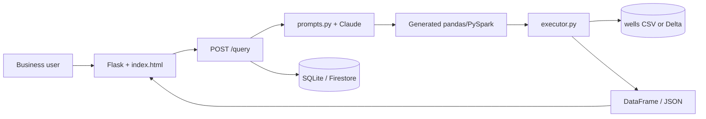

# QueryMind — Agent & Developer Guide

Natural-language analytics: business users ask questions in plain English; the app generates, executes, and visualizes PySpark/pandas code on well production data.

**Elevator pitch:** Type a question, get instant analytics — no SQL or PySpark required.

**Startup angle:** Enterprise data democratization (NL → big-data queries on Databricks).

---

## Stack

| Layer | Phase 1 (local) | Phase 2 (cloud) | Phase 3 (deploy) |
|-------|-----------------|-----------------|------------------|
| Backend | Flask | Flask + Databricks SDK | Gunicorn on Azure App Service |
| LLM | Anthropic Claude API | Same | Same (env vars) |
| Execution | pandas on local CSV | PySpark via Databricks SQL / jobs | Same as Phase 2 |
| Frontend | Jinja + vanilla JS, Chart.js, highlight.js | Same | Same |
| History (optional) | SQLite | SQLite or Firebase Firestore | SQLite / Firestore |
| Data | `sample_data/wells.csv` | Delta table `wells` | Same |

**Skills this project teaches:** LLM prompt engineering, safe code execution, Databricks SQL, query optimization, Python, agentic retry loops.

---

## Target Folder Structure

```
querymind/
├── app.py                 # Flask routes: /, /query, /history
├── prompts.py             # SYSTEM_PROMPT, fix_code prompts, schema injection
├── executor.py            # execute_code (pandas local → Databricks remote)
├── schema.py              # get_schema() from CSV or Databricks
├── history.py             # SQLite query log (Phase 2)
├── sample_data/
│   └── wells.csv          # Mock oil well data (200+ rows)
├── templates/
│   └── index.html         # Question input, code panel, table, chart
├── static/
│   ├── css/style.css
│   └── js/app.js          # Chart.js, example chips, fetch /query
├── requirements.txt
├── Dockerfile             # Phase 3
├── .env.example           # DUKE_API_KEY, DATABRICKS_* (never commit .env)
├── CLAUDE.md              # This file
└── README.md
```

### wells.csv schema

```
well_id, month, production_bbl, field, operator, depth_ft
```

Example row: `W001, 2024-01, 4200, Permian, Chevron, 8500`

---

## Architecture



**Request flow:** `question` → load schema → `generate_code` → `execute_code` → `{ code, result, columns }` → render table + chart.

---

## Phased Build Plan

### Phase 1 — Local MVP (Days 1–3)

**Goal:** Working demo on `localhost` with zero cloud dependencies.

#### Day 1 — Project setup + Claude integration

- [ ] `python -m venv venv && source venv/bin/activate`
- [ ] `pip install flask openai pandas flask-cors python-dotenv`
- [ ] Create `sample_data/wells.csv` (200+ realistic rows; use LLM to generate if needed)
- [ ] `prompts.py`: pandas `SYSTEM_PROMPT` with `{schema}` placeholder
- [ ] `app.py`: `POST /query` — `question` from JSON → schema → code → execute → JSON response
- [ ] `executor.py`: run generated code in a **restricted sandbox** (see Safety below)
- [ ] `.env.example` with `DUKE_API_KEY`

**Core route contract:**

```python
# POST /query  body: { "question": "..." }
# Response: { "code": "...", "result": { "columns": [], "rows": [] }, "error": null }
```

**System prompt (pandas) — canonical rules:**

- DataFrame is always named `df` (loaded from `wells.csv` before exec).
- Final answer must be assigned to `result` (DataFrame or scalar).
- No `print()`, `open()`, `os`, `subprocess`, or imports beyond pandas/numpy.
- Return **only** executable Python code, no markdown fences.

#### Day 2 — Frontend UI

- [ ] Single-page `templates/index.html`: question textarea, Run Query, code panel (highlight.js)
- [ ] Results as HTML table from JSON rows
- [ ] Chart.js bar/line when result has one categorical + one numeric column
- [ ] Loading and error states

#### Day 3 — Polish + edge cases

- [ ] Graceful handling when Claude returns invalid code (show error + optional retry UI)
- [ ] Example question chips (click to fill input):
  - "Which field had the highest production last quarter?"
  - "Show monthly production trend for Permian wells"
  - "Top 5 wells by average daily output"
  - "Compare operator performance by total barrels"
  - "Average depth by field"
  - "Month-over-month production change for W001"
- [ ] `requirements.txt` pinned loosely
- [ ] README quick-start: venv, `.env`, `flask run`

**Phase 1 exit criteria:** Demo runs end-to-end on mock CSV; code visible; table/chart renders; 3+ example chips work.

---

### Phase 2 — Databricks + Agentic Loop (Days 4–7)

**Goal:** Real PySpark on Delta; self-healing code generation; query history.

#### Day 4 — Databricks setup

- [ ] Databricks Free Edition workspace
- [ ] Upload `wells.csv` → register Delta table `wells`
- [ ] Personal Access Token; note workspace URL + HTTP path for SQL warehouse
- [ ] `pip install databricks-sdk databricks-sql-connector`
- [ ] Env: `DATABRICKS_HOST`, `DATABRICKS_TOKEN`, `DATABRICKS_HTTP_PATH`

#### Day 5 — PySpark generation + remote execution

- [ ] `SYSTEM_PROMPT_SPARK` in `prompts.py`:
  - `spark.table("wells")` as source
  - Final `result` as Spark DataFrame; end with `result = result.toPandas()` for API compatibility
- [ ] `executor.py`: mode flag `EXECUTOR=local|databricks`
- [ ] Databricks path: submit via SQL API or notebook job; return rows as JSON

#### Day 6 — Query history

- [ ] SQLite table: `id, timestamp, question, generated_code, result_preview, success`
- [ ] `GET /history?limit=10` for sidebar
- [ ] Optional: Firebase Firestore if aligning with your existing stack

#### Day 7 — Agentic error correction loop

```python
def generate_with_retry(question, schema, max_retries=3):
    code = generate_code(question, schema)
    for attempt in range(max_retries):
        try:
            result = execute_code(code)
            save_history(question, code, result, success=True)
            return code, result
        except Exception as e:
            code = fix_code(question, code, str(e), schema)
    save_history(question, code, None, success=False)
    raise RuntimeError("Could not generate valid code after retries")
```

- [ ] `fix_code()` prompt includes: original question, failed code, stderr/traceback, schema
- [ ] Log retry count in API response for demos

**Phase 2 exit criteria:** Same UI works against Databricks Delta; failed queries auto-retry up to 3 times; history sidebar shows last 10 queries.

---

### Phase 3 — Azure Deployment (Days 8–10)

**Goal:** Public URL for portfolio / demos.

#### Day 8 — Containerize

- [x] `Dockerfile`: Python 3.11-slim, gunicorn on port 8000
- [x] `.dockerignore`: venv, `__pycache__`, `.env`
- [x] `gunicorn.conf.py` (300s timeout for LLM/Databricks)
- [x] Local test: `docker build -t querymind . && docker run -p 8000:8000 --env-file .env`

#### Day 9 — Azure App Service

- [ ] Resource group + F1 plan (Azure for Students) — run [docs/DEPLOY-AZURE.md](./docs/DEPLOY-AZURE.md)
- [ ] Web app with app settings: `DUKE_API_KEY`, `DATABRICKS_*`, `EXECUTOR=databricks`
- [ ] Deploy container; verify `/health` and `/query`

#### Day 10 — Portfolio polish

- [x] README: architecture diagram, env setup, security notes, Docker quick start
- [x] [docs/DEPLOY-AZURE.md](./docs/DEPLOY-AZURE.md) — full Azure CLI guide
- [ ] Optional: `docs/demo.gif`, custom domain, public GitHub

**Phase 3 exit criteria:** Live HTTPS URL; secrets only in App Service config; README documents full stack.

---

## Product Roadmap (post-MVP)

| Version | Feature | Why |
|---------|---------|-----|
| v1 | NL → PySpark on one table | Proves concept |
| v2 | Multi-table joins, schema auto-detection | Enterprise realism |
| v3 | Scheduled reports (email/Slack) | Retention |
| v4 | Bring-your-own Databricks workspace | Enterprise sales |
| v5 | RBAC, audit logs | Chevron-scale compliance |

---

## Implementation Conventions

### Code style

- Python 3.11+
- Type hints on public functions in `executor.py`, `prompts.py`, `schema.py`
- Keep Flask routes thin; logic in modules
- Match existing naming if refactoring; don't over-abstract

### API

- JSON only for `/query`
- CORS: enable for local dev if frontend split later; `flask-cors` optional in Phase 1

### Prompt engineering

1. Always inject live schema (column names + dtypes + 2 sample rows).
2. Temperature low (~0) for code generation.
3. Strip markdown code fences from model output before execution.
4. On retry, include the **exact** execution error string.

### Safe execution (Phase 1 — critical)

Never `exec()` raw model output without guardrails:

- Allowlist builtins; pre-inject `df`, `pd`, `np` only
- Block `import`, `open`, `eval`, `exec`, `__`, subprocess, network
- Timeout execution (e.g. 10s)
- Cap result rows returned to client (e.g. 500)

Prefer `pandas` query methods over arbitrary Python when hardening further.

### Environment variables

```
DUKE_API_KEY=
DUKE_BASE_URL=https://litellm.oit.duke.edu
LLM_MODEL=gpt-4o
EXECUTOR=local          # local | databricks
DATABRICKS_HOST=
DATABRICKS_TOKEN=
DATABRICKS_HTTP_PATH=
FLASK_ENV=development
```

---

## Commands Reference

```bash
# Setup
python -m venv venv && source venv/bin/activate
pip install -r requirements.txt
cp .env.example .env   # add DUKE_API_KEY

# Run
export FLASK_APP=app.py
flask run --debug

# Test query (curl)
curl -X POST http://127.0.0.1:5000/query \
  -H "Content-Type: application/json" \
  -d '{"question": "Show total production by month"}'
```

---

## When Working in This Repo

1. **Read phase checklist above** — implement only what the current phase requires.
2. **Do not commit** `.env`, tokens, or real Chevron data.
3. **Test locally first** before Databricks or Azure changes.
4. **Prefer minimal diffs** — one phase feature per PR/commit when possible.
5. **Generated code is untrusted** — maintain sandbox in `executor.py` for every change to execution path.

---

## Timeline Summary

| Days | Phase | Milestone |
|------|-------|-----------|
| 1–3 | Local MVP | localhost demo, pandas + CSV |
| 4–7 | Databricks | PySpark + agentic retry + history |
| 8–10 | Azure | Live public URL + README/GIF |

**Primary demo metric:** A non-technical user clicks an example chip and sees a chart in under 10 seconds.
