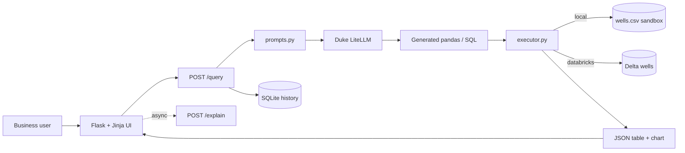

# QueryMind

**Type a question in plain English, get instant analytics on your data — no SQL or PySpark required.**

QueryMind is a natural-language analytics engine for oil & gas production data. A
business user types a question like *"Top 5 wells by production in 2024"*; the app
asks an LLM to generate **auditable** pandas or Databricks SQL, runs it safely,
and returns a table, an auto-built chart, a plain-English explanation, and a
one-click report — all in seconds.

**Live demo:** [querymind.azurewebsites.net](https://querymind.azurewebsites.net)

> Demo data is synthetic. Generated code is always shown so results can be audited.

---

## What it does

| | |
|---|---|
| **Ask** | Plain-English question (or a click on an example / schema column). |
| **Generate** | LLM writes pandas **or** Databricks SQL from the live schema. |
| **Self-heal** | On a runtime error, the exact error is fed back to the LLM to fix the code — up to 3 attempts. |
| **Run** | Sandboxed pandas locally, or SELECT-only SQL on a Databricks warehouse. |
| **Show** | Data table, auto-inferred Chart.js chart, generated code, and a plain-English **Explain** panel. |
| **Export** | A multi-sheet Excel report bundling the data, the chart image, and the code. |

Four pages share one header and design system:

- **/** — landing page (hero, how-it-works, live stats, capabilities)
- **/workspace** — the interactive ask → result experience
- **/dashboard** — pre-built KPIs and charts (no LLM; deterministic aggregates)
- **/schema** — Schema Explorer; click a column to start a question

A first-time visitor gets an auto-launching **guided tour** (replayable from the
header), and a frontend-only **sign-in / sign-up** modal that politely reports
accounts are still in development.

---

## Tech stack & why

| Layer | Choice | Why this choice |
|-------|--------|-----------------|
| **Web framework** | Flask (app factory) | Minimal, explicit, and easy to deploy; the app is small enough that a heavier framework would add ceremony without payoff. |
| **LLM** | Duke LiteLLM gateway via the OpenAI-compatible client | One client/API works against any gateway-hosted model; swapping models is just an env var (`LLM_MODEL`). Temperature is pinned to **0** so generated code is deterministic and auditable. |
| **Execution (local)** | pandas in a restricted `exec` sandbox | Zero infra to demo; generated code is **untrusted**, so the sandbox (allow-listed builtins, blocked imports/IO/network, 500-row cap) is the primary safety boundary. |
| **Execution (cloud)** | Databricks SQL Statements REST API | Real big-data execution on Delta. Using SQL (SELECT-only) means **no server-side `exec`** in cloud mode, and the REST API avoids a heavyweight Spark client. Calls are wrapped in hard timeouts so a cold/stalled warehouse can't hang a request. |
| **Frontend** | Jinja templates + vanilla JS, Chart.js, highlight.js | No build step or SPA framework — plain scripts keep the Flask stack simple to run and deploy, which matters more than framework features at this size. |
| **History** | SQLite | Zero-config, file-based, ships with Python — the right weight for a single-instance app vs. running a database server. |
| **Excel export** | openpyxl | Generates a styled, self-contained `.xlsx` (data + chart image + code) so a non-technical stakeholder gets an auditable artifact in one click. Imported lazily to keep the hot path light. |
| **Rate limiting** | flask-limiter | Protects the expensive LLM/Databricks endpoints (`/query`, `/explain`) and uploads with tighter per-route limits on top of a global default. |
| **Serving** | Gunicorn (gthread, 300s timeout) | LLM + warehouse calls are slow; threaded workers and a long timeout prevent premature request kills. |
| **Container** | Docker (python:3.11-slim) | Reproducible build; the Dockerfile copies explicit files (never `.env`/`.flaskenv`), so dev-only debug settings can't leak into production. |
| **Hosting** | Azure App Service + Azure Container Registry | Free/low-cost tier for students; managed TLS and a clean `*.azurewebsites.net` URL. |

### Key design decisions

- **Value-aware prompting.** The schema injected into the prompt includes the
  *distinct values* of categorical columns (field, operator). This was the single
  biggest fix for empty results — the model now filters on `"Permian"`, not
  `"Permian Basin"`, and falls back to a case-insensitive contains match when no
  value clearly matches.
- **Agentic retry over one-shot.** A single LLM call is unreliable enough that
  non-technical users would hit dead ends. Feeding the **exact** execution error
  back for repair (up to `MAX_QUERY_RETRIES`) turns flaky generation into a
  reliable experience; the retry count is surfaced for demos.
- **Explain is a separate, non-blocking call.** The workspace fetches the
  explanation *after* the result renders, and it **degrades gracefully** to a
  deterministic explanation if the LLM is down — so the Explain tab always shows
  something useful without slowing the main query.
- **Two interchangeable executors behind one interface.** `EXECUTOR=local|databricks`
  swaps pandas for SQL with no change to routes or frontend, so the same UI demos
  instantly on a laptop and runs against Delta in production.
- **Thin routes, logic in modules.** `app.py` only does request/response glue;
  generation, execution, schema, and history each live in their own module, which
  keeps the safety-critical execution path isolated and easy to audit.

---

## Project layout

```
QueryMind/
├── app.py              # Flask factory + JSON API (thin routes)
├── prompts.py          # System prompts, LLM client, generate_with_retry, explain_query
├── executor.py         # Sandboxed pandas + Databricks SQL execution, health probes
├── schema.py           # Schema string for the LLM + dataset/dashboard analytics
├── history.py          # SQLite query log (recent-queries sidebar)
├── data_io.py          # CSV import validation, CSV + Excel report export
├── gunicorn.conf.py    # Production server config
├── sample_data/wells.csv
├── templates/          # base, home, workspace, dashboard, schema (Jinja)
├── static/css/         # style.css (app + design system), pages.css (landing)
├── static/js/          # app, dashboard, schema, home, common, data-cache,
│                       #   chart-inference, auth, tour
├── databricks/         # Scheduled SQL to grow the wells table over time
├── scripts/deploy-azure.sh
├── docs/               # DEPLOY-AZURE.md, DATABRICKS-SAMPLE-DATA.md
├── Dockerfile / .dockerignore
└── requirements.txt
```

Python modules sit at the repo root (the standard small-Flask layout); each has a
module docstring explaining its role and the reasoning behind its trickier parts.

---

## Architecture



**Flow:** question → load schema (with distinct values) → generate code →
execute with auto-retry → return code + result + timing → render table / chart /
code, then lazily fetch the explanation.

---

## Quick start (local)

```bash
python3 -m venv venv && source venv/bin/activate
pip install -r requirements.txt
cp .env.example .env          # set DUKE_API_KEY; leave EXECUTOR=local
flask run                     # uses .flaskenv: port 8000, debug/auto-reload on
```

Open **http://127.0.0.1:8000**. Try an example chip, or hit the API directly:

```bash
curl -s -X POST http://127.0.0.1:8000/query \
  -H "Content-Type: application/json" \
  -d '{"question": "Show total production by field"}'
```

> Port 8000 (not 5000) avoids the macOS AirPlay Receiver, which squats on 5000
> and returns blank/403 pages. `.flaskenv` also enables debug so template/code
> edits auto-reload in dev.

### Environment variables

| Variable | Purpose |
|----------|---------|
| `DUKE_API_KEY` | LiteLLM API key (**required**) |
| `DUKE_BASE_URL` | LLM gateway base URL (default `https://litellm.oit.duke.edu`) |
| `LLM_MODEL` | Model name, e.g. `gpt-5.5` |
| `EXECUTOR` | `local` (sandboxed pandas) or `databricks` (SQL) |
| `DATABRICKS_HOST` / `DATABRICKS_TOKEN` / `DATABRICKS_HTTP_PATH` | SQL warehouse connection |
| `DATABRICKS_TABLE` | Unity Catalog table (default `workspace.querymind.wells`) |
| `MAX_QUERY_RETRIES` | Agentic retry attempts (default `3`) |
| `QUERYMIND_PAGE_CACHE_SEC` | Server-side cache TTL for schema/dashboard payloads |
| `PORT` / `WEB_CONCURRENCY` / `GUNICORN_TIMEOUT` | Production server tuning |

See [.env.example](./.env.example) for the full list. **Never commit `.env`.**

---

## Docker

```bash
docker build -t querymind .
docker run --rm -p 8000:8000 --env-file .env querymind
```

Serves on **http://127.0.0.1:8000** via Gunicorn. Health: `GET /health`.

---

## Azure deployment

Step-by-step guide: **[docs/DEPLOY-AZURE.md](./docs/DEPLOY-AZURE.md)**.

One command (after `az login` and a filled `.env`):

```bash
RESOURCE_GROUP=querymind-rg ACR_NAME=<your-acr> PLAN_NAME=querymind-plan \
APP_NAME=querymind ./scripts/deploy-azure.sh
```

On Apple Silicon the script builds **linux/amd64** images (required by App
Service). It pushes to ACR, ensures a Linux plan, deploys the container with
`WEBSITES_PORT=8000`, grants the web app **AcrPull**, and applies app settings
from `.env`. Multiple apps can share one plan at no extra cost.

---

## Keeping the dataset fresh (optional)

In Databricks mode, a scheduled SQL job can grow the `wells` table **every hour**
so the Dashboard and Workspace stay alive automatically. The SQL is schema-driven
(no new columns) and date-capped so inserted months **never surpass the current
real date**; the primary job adds a new well each run, with an optional backfill
that fills history up to today. On **Databricks Free Edition this is free** —
serverless, no billing, just a fair-usage quota. Setup, scheduling, and cost
notes: **[docs/DATABRICKS-SAMPLE-DATA.md](./docs/DATABRICKS-SAMPLE-DATA.md)**.

---

## API

| Method | Path | Description |
|--------|------|-------------|
| `GET` | `/`, `/workspace`, `/dashboard`, `/schema` | Pages |
| `POST` | `/query` | `{ "question": "..." }` → `code`, `result`, `elapsed_ms`, `retry_count` |
| `POST` | `/explain` | Plain-English explanation of an executed query (async) |
| `POST` | `/export/csv` | Result table as CSV |
| `POST` | `/export/xlsx` | Multi-sheet Excel report (data + chart + code) |
| `GET` | `/export/template` | Blank CSV template for imports |
| `POST` | `/import/csv` | Replace the local wells dataset |
| `GET` | `/history?limit=10` · `DELETE /history` | Recent queries / clear |
| `GET` | `/dashboard/data` · `/schema/info` · `/dataset/stats` | Page data + stats |
| `GET` | `/health` · `/health/databricks` | App mode / warehouse connectivity |

---

## Security

- **Secrets** live only in `.env` (local) or Azure App Settings (prod) — never in git.
- **Generated code is untrusted.** Local mode runs it in a restricted sandbox
  (allow-listed builtins; blocked imports, file IO, network, `eval`/`exec`).
  Cloud mode allows **SELECT-only** SQL and never `exec`s on the server.
- **Rate limiting** caps the LLM/Databricks endpoints and uploads.
- **HTTPS** via App Service managed TLS for public demos.

---

## Project status & roadmap

| Phase | Status |
|-------|--------|
| Phase 1 — Local MVP (pandas + CSV) | Done |
| Phase 2 — Databricks + history + agentic retry | Done |
| Phase 3 — Docker + Azure (live) | Done |

| Version | Product focus |
|---------|---------------|
| v1 | Single-table NL → analytics |
| v2 | Multi-table joins, schema browser |
| v3 | Scheduled email/Slack reports |
| v4 | Customer-owned Databricks workspaces |
| v5 | RBAC + audit logs |

Deeper implementation notes and checklists: **[CLAUDE.md](./CLAUDE.md)**.

---

## License

Demo / portfolio project — see the repository owner for terms.