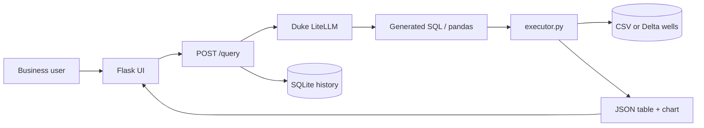

# QueryMind

**Type a question in plain English, get instant analytics on your data — no SQL or PySpark required.**

QueryMind is an NL-to-analytics engine for oil-well production data: business users ask questions in plain English, the app generates auditable SQL/pandas, runs it on Databricks (or local CSV), and returns tables and charts.

| | |
|---|---|
| **Stack** | Flask, Duke LiteLLM (GPT), pandas / Databricks SQL, Chart.js |
| **Phase 1** | Local CSV + sandboxed pandas |
| **Phase 2** | Databricks Delta, query history, agentic retry (up to 3) |
| **Phase 3** | Docker + Gunicorn → Azure App Service |

Implementation details and checklists: **[CLAUDE.md](./CLAUDE.md)** · Azure deploy: **[docs/DEPLOY-AZURE.md](./docs/DEPLOY-AZURE.md)**

---

## Architecture



**Flow:** question → schema → generate code → execute (with auto-retry on failure) → table, chart, and code in the browser.

---

## Quick start (local)

```bash
python3 -m venv venv && source venv/bin/activate
pip install -r requirements.txt
cp .env.example .env   # set DUKE_API_KEY; optional DATABRICKS_*
export FLASK_APP=app.py
flask run --debug
```

Open **http://127.0.0.1:5000**. Try an example question or:

```bash
curl -s -X POST http://127.0.0.1:5000/query \
  -H "Content-Type: application/json" \
  -d '{"question": "Show total production by field"}'
```

### Environment variables

| Variable | Purpose |
|----------|---------|
| `DUKE_API_KEY` | Duke LiteLLM API key (required) |
| `DUKE_BASE_URL` | Default `https://litellm.oit.duke.edu` |
| `LLM_MODEL` | e.g. `gpt-5.5` |
| `EXECUTOR` | `local` (CSV) or `databricks` |
| `DATABRICKS_HOST`, `DATABRICKS_TOKEN`, `DATABRICKS_HTTP_PATH` | Databricks SQL warehouse |
| `DATABRICKS_TABLE` | Default `workspace.querymind.wells` |

See [.env.example](./.env.example) for the full list.

---

## Docker (Phase 3)

```bash
docker build -t querymind .
docker run --rm -p 8000:8000 --env-file .env querymind
```

App listens on **http://127.0.0.1:8000** (Gunicorn). Health: `GET /health`.

---

## Azure deployment

Step-by-step: **[docs/DEPLOY-AZURE.md](./docs/DEPLOY-AZURE.md)**

One-command deploy (after `az login` and a filled `.env`):

```bash
chmod +x scripts/deploy-azure.sh
./scripts/deploy-azure.sh
```

On Apple Silicon, the script builds **linux/amd64** images (required by App Service). Summary:

1. Build and push **amd64** image to Azure Container Registry (`docker buildx` or `az acr build`).
2. Create a Linux App Service plan (F1 works for demos).
3. Deploy the container; set `WEBSITES_PORT=8000`; grant the web app **AcrPull** on the registry.
4. Add secrets in **App Service → Configuration** (never commit `.env`).
5. Set `EXECUTOR=databricks` for production demos against Delta.

---

## API

| Method | Path | Description |
|--------|------|-------------|
| `GET` | `/` | Web UI |
| `POST` | `/query` | `{ "question": "..." }` → code, result, `elapsed_ms`, `retry_count` |
| `GET` | `/history?limit=10` | Recent queries |
| `DELETE` | `/history` | Clear history |
| `GET` | `/dataset/stats` | Row / field / operator / well counts |
| `GET` | `/health` | App mode and config |
| `GET` | `/health/databricks` | Warehouse connectivity |
| `POST` | `/import/csv` | Replace local wells CSV |
| `GET` | `/export/template` | Download CSV template |

---

## Security

- **Secrets:** Store `DUKE_API_KEY` and `DATABRICKS_TOKEN` only in `.env` (local) or Azure App Settings (production). Never commit `.env`.
- **Generated code:** Treated as untrusted; local mode uses a restricted sandbox in `executor.py`.
- **Databricks:** Uses parameterized SQL via the Statements API; no arbitrary `exec()` on the server for cloud mode.
- **HTTPS:** Use App Service default TLS for public demos.

---

## Project status

| Phase | Status |
|-------|--------|
| Phase 1 — Local MVP | Done |
| Phase 2 — Databricks + history + retry | Done |
| Phase 3 — Docker + Azure docs | Done (deploy to your subscription) |

---

## Roadmap (product)

| Version | Focus |
|---------|--------|
| v1 | Single-table NL → analytics |
| v2 | Multi-table joins, schema browser |
| v3 | Scheduled email/Slack reports |
| v4 | Customer-owned Databricks workspaces |
| v5 | RBAC + audit logs |

---

## Demo media

Add a short screen recording as `docs/demo.gif` and link it here for portfolio use.

---

## License

Demo / portfolio project — see repository owner for terms.
